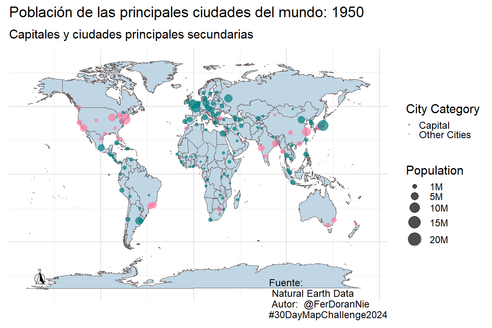

# 30DayMapChallenge
Este es mi repositorio donde guardaré los códigos para hacer los mapas para el challenge.

## Día 4:
### Mapa de la afluencia de pasajeros en el metro de la CDMX
#### Software utilizado:
- R
- Tableau (Public)

#### Origen de los datos 
- [Afluencia de pasajeros](https://datos.cdmx.gob.mx/dataset/afluencia-diaria-del-metro-cdmx)
- [Mapa estaciones del metro](https://datos.cdmx.gob.mx/dataset/lineas-y-estaciones-del-metro/resource/0869e0dd-6876-4446-a199-8f670a359c00)
- [Mapa alcaldías](https://datos.cdmx.gob.mx/dataset/alcaldias)

[Mapa en Tableau Public](https://public.tableau.com/views/CDMXSUBWAYANGENERALOVERVIEW/MetrodelaCiudaddeMxico?:language=en-US&publish=yes&:sid=&:redirect=auth&:display_count=n&:origin=viz_share_link)

## Día 5:
### Mapa de la sequía en México en los últimos 6 años
#### Software utilizado:
- R

#### Origen de los datos
- [Datos de sequía](https://smn.conagua.gob.mx/es/climatologia/monitor-de-sequia/monitor-de-sequia-en-mexico)
- [Mapa de municipios](http://www.conabio.gob.mx/informacion/gis/?vns=gis_root/dipol/mupal/mun23gw)

## Día 6:
### Atlas de riesgo sísmico y de inundación de la CDMX
#### Software utilizado:
- R

#### Origen de los datos
- [Datos de atlas de riesgo sísmico](https://datos.cdmx.gob.mx/dataset/atlas-de-riesgo-sismico)
- [Datos de atlas de inundación ](https://datos.cdmx.gob.mx/dataset/atlas-de-riesgo-inundaciones)

[Mapa en Tableau Public](https://public.tableau.com/views/AtlasderiesgosCDMX/AtlasderiesgosCDMX?:language=en-US&:sid=&:redirect=auth&:display_count=n&:origin=viz_share_link)

## Día 7:
### Mapa de densidad poblacional y población total por colonia en la CDMX
#### Software utilizado:
- Python

#### Origen de los datos
- [Datos de densidad por colonia](https://datos.cdmx.gob.mx/dataset/atlas-de-riesgo-sismico)

[Mapa en Tableau Public](https://public.tableau.com/views/DensidadPoblacionalCDMX/CDMXTotalPopulationandDensity?:language=en-US&publish=yes&:sid=&:redirect=auth&:display_count=n&:origin=viz_share_link)

## Día 8:
### Mapa de las fechas de inicio de construcción de los principales transportes de la CDMX
#### Software utilizado:
- Python

#### Origen de los datos
- [Datos de coordenadas y fechas](https://www.citylines.co/)

[Mapa en Tableau Public](https://public.tableau.com/shared/QS8ZYXDPK?:display_count=n&:origin=viz_share_link)

## Día 9:
### Mapa de comparación del top 10 de países por PIB vs sus vecinos o países cercanos
### ¿Cuántos países se necesitan para igualar su PIB?
#### Software utilizado:
- R

#### Origen de los datos
- [Datos de PIB](https://data.worldbank.org/indicator/NY.GDP.MKTP.CD)
- [Cartografía](https://www.naturalearthdata.com/downloads/50m-cultural-vectors/)

[Mapa en Tableau Public](https://public.tableau.com/views/TopCountriesvsothersGDPComparison/Top10Countriesvstheirneighborhoods?:language=en-US&publish=yes&:sid=&:redirect=auth&:display_count=n&:origin=viz_share_link)

## Día 10:
### Mapa animado con las proyecciones de población de la ONU para 2030, 2050, 2075 y 2100
#### Software utilizado:
- Python

#### Origen de los datos
- [Datos de Población](https://population.un.org/wpp/Download/)
- [Cartografía](https://www.naturalearthdata.com/downloads/50m-cultural-vectors/)

## Día 11:
### Mapa animado con los países y como se ven con diferentes proyecciones geográficas
#### Software utilizado:
- Python

#### Origen de los datos
- [Cartografía](https://www.naturalearthdata.com/downloads/50m-cultural-vectors/)

## Día 12:
### Mapas comparativos del consumo de agua por colonia y población en México
#### ¿Estará correlacionado el consumo de agua con más población? 
#### Software utilizado:
- R

#### Origen de los datos
- [Datos](https://datos.cdmx.gob.mx/dataset/diferencia-consumo-total-sacmex)

## Día 13:
### Uso de suelo y vegetación en México por municipio
#### Software utilizado:
- R

#### Origen de los datos
- [Datos de vegetación y uso de suelo](http://www.conabio.gob.mx/informacion/gis/?vns=gis_root/usv/inegi/usv250s7gw)
- [Cartografía de los municipios](http://www.conabio.gob.mx/informacion/gis/?vns=gis_root/dipol/mupal/mun23gw)

.png)

## Día 14:
### Presencia de transporte público dividido por tipo en las manzanas del área metropolitana de la CDMX
#### Software utilizado:
- R

#### Origen de los datos
- [Datos](http://www.conabio.gob.mx/informacion/gis/?vns=gis_root/usv/inegi/usv250s7gw)

## Día 15:
### Producción de los principales cereales en 2022
#### Software utilizado:
- R

[Mapa en Tableau Public](https://public.tableau.com/views/Cerealproduction2022/Produccindecereales?:language=en-US&publish=yes&:sid=&:redirect=auth&:display_count=n&:origin=viz_share_link)

#### Origen de los datos
- [Datos](https://www.fao.org/faostat/en)

## Día 17:
### Producción de los principales cereales en 2022
#### Software utilizado:
- R

#### Origen de los datos
- [Datos](https://www.inegi.org.mx/programas/ccpv/2020/#microdatos)

## Día 18:
### ¿Qué tan llenas están las presas en México a finales de 2024?
#### Software utilizado:
- R

#### Origen de los datos
- [Datos de almacenamiento](https://sinav30.conagua.gob.mx:8080/SINA/?opcion=base)
- [Cartografía de estados](http://www.conabio.gob.mx/informacion/gis/)

## Día 20:
### ¿Cuál es el porcentaje de llenado histórico del sistema Cutzamala? 
#### Software utilizado:
- Python

#### Origen de los datos
- [Datos históricos](https://sinav30.conagua.gob.mx:8080/Presas/)
- [Coordenadas](https://sinav30.conagua.gob.mx:8080/SINA/)

[Mapa en Tableau Public](https://public.tableau.com/shared/MDMMF3FRH?:display_count=n&:origin=viz_share_link)

## Día 21:
### ¿Cómo es la población por municipio en México? 
#### Software utilizado:
- Python

#### Origen de los datos
- [Datos](https://www.inegi.org.mx/programas/ccpv/2020/#microdatos)

## Día 22:
### ¿Cómo ha cambiado la población por capitales y ciudades secundarias en todos los países? 
#### Software utilizado:
- R

#### Origen de los datos
- [Datos](https://www.naturalearthdata.com/downloads/10m-cultural-vectors/)

## Día 23:
### ¿Cómo ha sido la densidad de delitos histórica en la CDMX? 
#### Software utilizado:
- No se uso lenguaje de programación
- Tableau Public

#### Origen de los datos
- [Datos](https://datos.cdmx.gob.mx/dataset/victimas-en-carpetas-de-investigacion-fgj)

[Mapa en Tableau Public](https://public.tableau.com/views/DelitosCDMX_17324215654990/DelitosdelaCDMXVistahistrica?:language=en-US&:sid=&:redirect=auth&:display_count=n&:origin=viz_share_link)

## Día 24:
### ¿Cómo ha sido la densidad de delitos histórica en la CDMX? 
#### Software utilizado:
- R

#### Origen de los datos
- [Datos](https://www.naturalearthdata.com/downloads/10m-cultural-vectors/)

## Día 25:
### ¿Cómo han migrado las personas dentro del territorio mexicano? 
#### Software utilizado:
- R

#### Origen de los datos
- [Datos](https://hub.worldpop.org/geodata/summary?id=1283)

## Día 26:
### ¿Cómo ha sido el porcentaje de migración por municipio en México? 
#### Software utilizado:
- Python

#### Origen de los datos
- [Datos](https://www.inegi.org.mx/temas/migracion/#tabulados)

